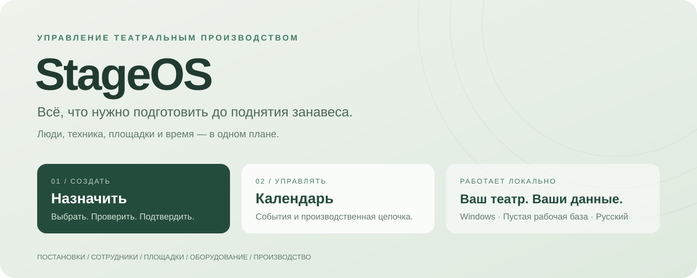

# StageOS

**Театральное производство в одном рабочем пространстве** 
постановки · люди · площадки · техника · расписание

> [!NOTE]
> **1.0.0-rc.1 — кандидат на релиз.** Windows Portable собран и проверен автоматическими тестами. Запуск и закрытие самого окна на Windows 10/11 ещё требуют ручной приёмки. Поставка содержит **пустую рабочую базу**: никаких вымышленных спектаклей, сотрудников или оборудования.

## Скачать

| Файл | Назначение |
|---|---|
| [**StageOS-Release-1.0.0-rc.1.zip**](https://github.com/wavessevaw/StageOS/releases/download/v1.0.0-rc.1/StageOS-Release-1.0.0-rc.1.zip) | Windows-приложение, встроенный Python, пустая база, руководство и отчёты |
| [Страница релиза](https://github.com/wavessevaw/StageOS/releases/tag/v1.0.0-rc.1) | Описание версии, файлы и контрольные суммы |
| [Руководство](README_RU.md) | Установка, первый спектакль, резервное копирование |

**Запуск:** распаковать весь архив → открыть <code>StageOS/Windows-Portable/StageOS.exe</code>. Python, сервер и терминал вручную запускать не нужно.

## Зачем StageOS

Спектакль — это не только дата и название. До него нужно перевезти декорации, смонтировать сцену, подготовить звук и свет, провести прогон и вызвать людей вовремя. Один заболевший сотрудник или недоступная площадка меняют весь план.

**StageOS связывает паспорт постановки, реальные ресурсы и производственную хронологию.** При назначении события система проверяет пересечения, техническую совместимость и подготовку. Решение о сохранении принимает человек.

## Два основных сценария

| Назначить | Календарь |
|---|---|
| Дата, тип, постановка, состав, площадка и время | Сохранённые спектакли, репетиции и производственные задачи |
| Автоматическая проверка доступности | День, неделя, месяц и производственная временная шкала |
| Предварительный план с редактируемыми этапами | Фильтры по людям, цехам, площадкам, постановкам и технике |
| Подтверждение → запись одной транзакцией | Перенос и замены → проверка → подтверждение |

## Возможности

- **Постановки.** Паспорт спектакля: роли и два состава, допущенный резерв, постоянные ответственные, хор, балет, оркестр, технические команды, имущество, требования площадки и этапы подготовки. Создание и редактирование по разделам.
- **Люди.** Сотрудники по цехам, квалификация и специализация, статистика и персональный календарь. Оркестр, хор и балет входят в общий каталог сотрудников.
- **Площадки.** Размеры сцены, вместимость, механика, штанкеты, софиты, нагрузка, мощность, световые сети, грузовые ворота и часы работы. Числовая проверка совместимости и адаптации постановки.
- **Имущество.** Категории и подкатегории цехов, комплекты и отдельные единицы оборудования, декорации, реквизит, костюмы и транспорт. Количество создаёт физические ресурсы с отдельной занятостью.
- **Производственный план.** Параллельные монтажи, перевозки, проверки, вызовы и демонтаж. Время этапов можно закреплять вручную; опциональный прогон по умолчанию 11:00–14:00.
- **Репетиции.** Выбор сцен, нужных цехов и конкретных участников. Необязательно вызывать все службы постановки.
- **Конфликты и замены.** Пересечения людей, площадок и техники; недоступность и обслуживание; квалификация, переезды и сроки подготовки. Замена сотрудника в конкретном событии, в том числе допущенным исполнителем другого состава.
- **Изменения.** Примечания, история, предложения с согласованием и отклонением. Принудительное назначение требует причины и сохраняет сведения о конфликтах.
- **Локальная работа.** SQLite, резервные копии и проверка импорта. Основное планирование не зависит от подключения к ИИ или интернету.

## Быстрый старт

1. Скачайте ZIP со [страницы релиза](https://github.com/wavessevaw/StageOS/releases/tag/v1.0.0-rc.1). В свойствах ZIP выберите **«Разблокировать»**, если этот пункт есть, и полностью распакуйте архив.
2. Запустите **StageOS.exe**, введите название театра и нажмите **«Создать рабочую базу»**.
3. В **«Площадки»** заполните паспорт зала. В **«Сотрудники»** добавьте людей и их цеха.
4. В **«Добавить спектакль»** создайте постановку, выберите участников, имущество и требования.
5. В **«Назначить»** выберите дату, состав, площадку и время. Проверьте людей, совместимость и производственный план.
6. Подтвердите — событие и связанные задачи появятся в **«Календаре»**.

Для окна нужны системный .NET Framework и Microsoft Edge WebView2 Runtime. База и журнал ошибок: <code>%LOCALAPPDATA%\StageOS-Work</code>. Обновление не должно удалять эту папку. Прежняя демо-база не открывается автоматически и не удаляется.

## Проверки и статус

| Проверка | Фактический результат |
|---|---|
| Backend | **74 теста пройдены**, Linux и Windows |
| Интерфейс | **15 сценариев + 1 сценарий пустой базы пройдены**, Chromium |
| TypeScript и production build | Пройдены |
| Windows Portable | Собран |
| Встроенные Python / SQLite / CP-SAT | Самотест пройден, событие сохранено |
| CLR / WinForms | Импорт пройден |
| Окно Windows 10/11 | Ручная приёмка ещё не выполнена |

Подтверждённый [запуск CI](https://github.com/wavessevaw/StageOS/actions/runs/37163168708). Новый релиз публикуется автоматикой после повторных проверок и сборки.

<strong>Границы текущей версии</strong>

- Фиксированы два состава; произвольное число составов пока не поддерживается.
- Оборудование резервируется по экземплярам. Автоматического складского подбора обезличенного количества нет.
- Технические текстовые паспорта и меры безопасности — описательные поля. Система не заменяет расчёт конструкций или электрическую проектную документацию.
- Перерывы входят в непрерывное консервативное резервирование людей.
- Изменение паспорта постановки не переписывает сохранённые события: их нужно отдельно изменить и подтвердить.
- Интеграции с реальными локальными LLM и PostgreSQL не проходили приёмку. Многопользовательский сервер и права доступа не входят в эту поставку.
- Windows-host: Win32 + pywebview/WebView2. Tauri/NSIS не собраны, EXE не подписан.

Полный перечень: [аудит и ограничения](RELEASE_AUDIT_RU.md).

## Документация

| Документ | Содержание |
|---|---|
| [Руководство](README_RU.md) | Установка, работа и резервные копии |
| [Описание релиза](docs/releases/1.0.0-rc.1.md) | Что входит в версию и как начать |
| [Аудит](RELEASE_AUDIT_RU.md) | Исправленные ошибки и ограничения |
| [Тесты](TEST_RESULTS.md) · [Сборка](BUILD_RESULTS.md) | Фактические результаты |
| [Архитектура](ARCHITECTURE.md) | Модель данных, движки и интерфейс |
| [Сторонние компоненты](THIRD_PARTY.md) | Сведения о составе поставки |

<strong>Для разработчиков</strong>

Python 3.12 · FastAPI · SQLAlchemy · Alembic · SQLite · OR-Tools CP-SAT · React · TypeScript · FullCalendar.

| Каталог | Назначение |
|---|---|
| backend | API, ресурсы, конфликты, совместимость и планирование |
| frontend | Интерфейс и интеграционные тесты |
| migrations | Схема базы |
| windows | Нативный launcher и оконный host |
| tests | Регрессионные проверки |
| scripts | Сборка и упаковка |

Сборка на Windows: <code>./build_windows.ps1 -Mode Portable</code>. Backend: <code>python -m pytest tests -q</code>. Интерфейс: Playwright в frontend, включая отдельный тест пустой рабочей базы.

Релизная автоматика проверяет код, собирает Windows-приложение, запускает самотест и публикует ZIP, документы и SHA-256. Демонстрационные фикстуры используются только при тестировании и не входят в packaged backend.

