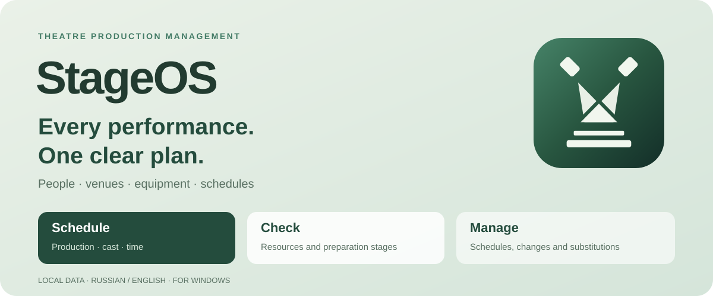

**StageOS Server 1.0.4:** host your theatre database on your PC and connect staff desktops with an address, connection code and personal accounts. [Setup guide (Russian)](docs/SERVER_SETUP_RU.md).

Version 1.0.4 adds isolated theatre workspaces, personal sign-in and administrator/planner/viewer roles. Switch theatres and manage your team from the account menu.

# StageOS

### Every performance. One clear plan.

**People, venues, equipment and schedules — together in your theatre's workspace.**

[**Download for Windows**](https://github.com/wavessevaw/StageOS/releases) · [**Getting started**](#your-first-performance-in-stageos) · [**Русская версия**](README.md)

## The performance starts long before the curtain rises

Loading, travel, setup, lighting, sound, run-throughs, calls, the performance itself and teardown. Each stage needs the right people, equipment and time.

**StageOS brings that chain into one practical production plan.** Choose a production, cast, venue and curtain time. The system checks resource availability, technical requirements and preparation. Before committing anything, you see what's ready, what overlaps and what needs attention.

Built for technical directors, stage managers, department heads and everyone who coordinates the many dependencies behind a performance. Particularly useful for multiple venues and touring work.

## From scheduling to readiness

| Step | What you get |
|---|---|
| **Choose a production** | Its passport contains casts, responsible staff, teams, assets and requirements |
| **Check the plan** | People and equipment availability, venue compatibility, preparation stages and concrete conflicts |
| **Confirm** | The event, production tasks and resource bookings are saved together |
| **Manage the schedule** | Calendar views, production timelines, substitutions and changes with fresh checks |

### Schedule: a few choices, the full production picture

Date. Event type. Production. Cast. Venue. Time.

The preview shows who works, when preparation starts, which assets are booked and whether the venue fits. Stage times can be edited. A show-day run-through is optional. Rehearsals can include only the departments and people you need.

### Calendar: the performance and everything leading up to it

Day, week and month views give you a familiar overview. **Production timeline** reveals loading, travel, parallel setup, checks and teardown.

Filter by employee, department, venue, production or equipment kit. Open event details directly in the calendar. Dragging an event or resizing a rehearsal opens a new preview; changes are saved after confirmation.

## Your people and assets become part of the plan

| Area | Capabilities |
|---|---|
| **Productions** | Editable passports, roles, two casts and reserves, responsible staff, choir, ballet, orchestra and technical teams |
| **Employees** | Department categories, qualifications, availability, individual calendars and workload statistics |
| **Equipment** | Department and category catalogues, individually tracked units and kits, resource status and booking checks |
| **Venues** | Stage dimensions, audience seating, orchestra capacity, loading gates, power, fly systems, lighting bars and positions |
| **Changes** | Event-specific staff and equipment substitutions, recalculated plans, approval and rejection |
| **Production work** | Editable preparation stages, dependencies, call sheets, notes and planned/actual work |

Permanent production responsibility and the person working a specific event are recorded separately. A substitution changes the event assignment; it does not silently rewrite the production's permanent team.

## Spot problems before the crew arrives

A conflict points to the affected resource, reason, required period and overlapping booking. Venue checks cover geometry, fly machinery, load capacity, lighting infrastructure, power, orchestra space and loading gates.

You can adjust a plan, choose a suitable substitute or use a saved venue adaptation. An administrator can force an assignment with a recorded reason; conflicts remain visible. **Technical checks support planning and do not replace inspection or professional approval of stage installations.**

## Local data. A working core without AI.

StageOS stores data in a local SQLite database. Scheduling, compatibility checks, conflict detection, the constraint solver and analytics work without the internet or an LLM.

The optional assistant connects to an OpenAI-compatible endpoint, including locally hosted models. It uses StageOS context, and scheduling commands still pass through validation, calculation, preview and confirmation. Model requests send context to the configured endpoint; core operation does not require them.

## Your first performance in StageOS

1. Download the Windows Portable archive from [Releases](https://github.com/wavessevaw/StageOS/releases) and extract it completely.
2. Run `StageOS.exe`. Microsoft Edge WebView2 Runtime is required.
3. Choose an existing theatre or create one with its administrator account, then sign in. For shared access, follow the [StageOS Server setup guide](docs/SERVER_SETUP_RU.md). Release packages start empty, with no demo repertoire, employees or equipment.
4. Add your venues and employees, then create a production passport with casts, teams and individually tracked assets.
5. Open Schedule, check the preview and confirm. The event and preparation chain appear in Calendar.

Switch **Russian / English** in the header. Your preference is stored in the database and restored on restart. User-entered production names, people and notes keep their original language.

## Release status

**Version 1.0.4** adds StageOS Server on your PC, a shared database for multiple desktops, connection codes, personal accounts, automatic refresh and stale-plan protection. Incomplete passports, independent department casts and PDF/PNG exports remain available. The working package starts with an empty database. Publication is gated by [backend, browser UI and Windows checks](https://github.com/wavessevaw/StageOS/actions/workflows/release.yml); exact results and limitations are included in the release archive. Back up your database before updating.

Verification and current limits

The audit adds independent regression tests for saved plans, conflicting resources, database integrity and imports. Automated Linux and Windows checks include backend tests, browser scenarios, portable runtime checks and a real WebView2 window smoke test.

A successful Windows Server CI run does not establish complete manual acceptance on Windows 10 and 11. The executable is unsigned. Windows download-zone blocking may require unblocking a trusted downloaded archive before extraction. The current native host uses pywebview; the Tauri sources are not the published desktop build. SQLite is the tested database; PostgreSQL deployment has not been validated. There are two primary casts, and inventory is tracked per unit rather than as shared quantity pools. Some technical notes remain descriptive rather than solver constraints. Real model quality and external LLM configurations require separate testing.

## Documentation and development

- [Russian user guide](README_RU.md)
- [Architecture](ARCHITECTURE.md)
- [Windows build](build_windows.ps1)
- [Packaging](package_windows.ps1)
- [Tests and automated checks](https://github.com/wavessevaw/StageOS/actions)

React and TypeScript power the interface. FastAPI, SQLAlchemy, Alembic and SQLite manage local data. Google OR-Tools CP-SAT calculates production constraints. The LLM is an optional interface layer, not the scheduling source of truth.

**StageOS — give every performance a plan the whole team can follow.**

## Share a schedule with your team

Open Calendar → **Export schedule**. Choose up to 31 days, current filters, staff calls, production stages and notes. The matrix groups dates, venues and rooms. PDF is ready for printing; PNG is convenient for sharing. Multiple PNG pages download as a ZIP.

Database backup/export is separate: Settings → Download backup. Restore with Open existing database. A failed import leaves the active database unchanged; a successful import creates a managed copy and persists the selection for future launches.

Version 1.0.2 fixes imported source information and production credits, displays eligible performers without assigning casts, and clearly marks unspecified preparation time.
